# 🗺️ Bản đồ Du lịch Số — Xã Tô Múa

> Hệ thống quản lý bản đồ du lịch số cho xã Tô Múa, tỉnh Sơn La, Việt Nam. Được xây dựng để phục vụ phát triển du lịch cộng đồng và giới thiệu bản sắc văn hóa vùng cao Tây Bắc.

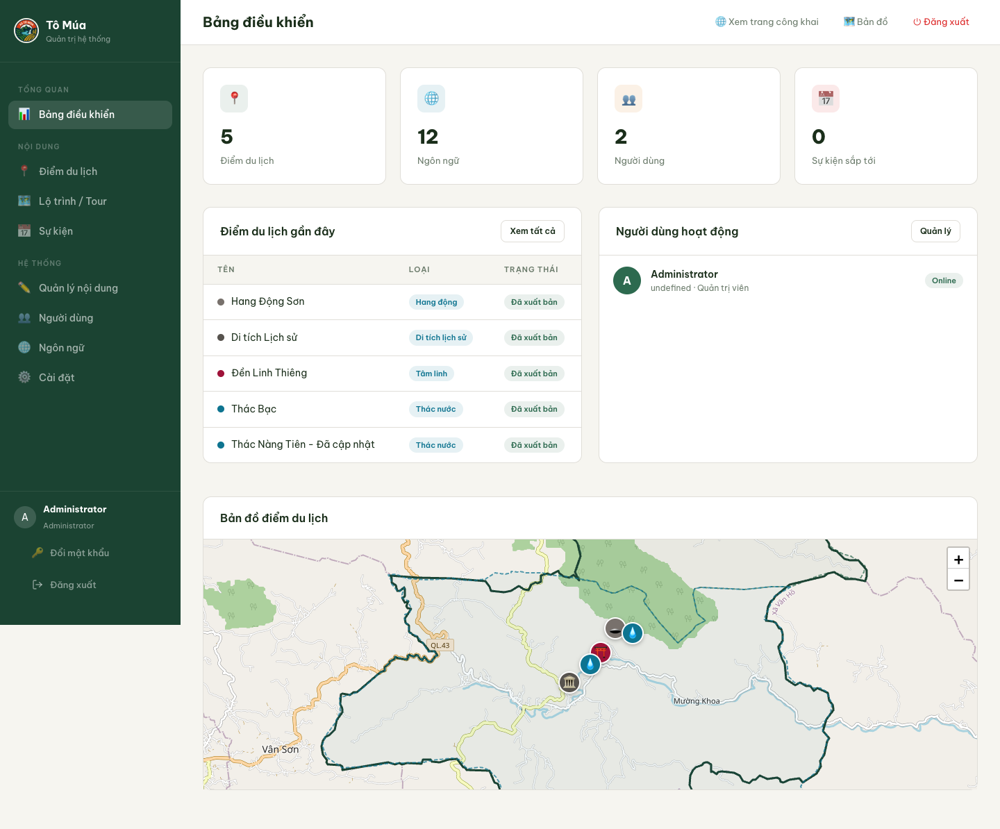

## 📋 Giới thiệu

Xã Tô Múa được thành lập năm 2025 từ việc sáp nhập 3 xã: Tô Múa, Chiềng Khoa và Suối Bàng. Hệ thống bản đồ số này giúp:

- 🗺️ Hiển thị bản đồ tương tác với các điểm du lịch
- 📍 Quản lý thông tin điểm đến, lộ trình, sự kiện
- 🌐 Hỗ trợ 12 ngôn ngữ cho du khách quốc tế
- 👥 Phân quyền quản trị viên và cộng tác viên
- 📱 Responsive design, hoạt động trên mọi thiết bị

## 🚀 Tính năng chính

### Quản trị viên (Admin)
- ✅ Dashboard thống kê tổng quan
- ✅ CRUD điểm du lịch, lộ trình, sự kiện
- ✅ Phê duyệt nội dung cộng tác viên
- ✅ Quản lý người dùng và phân quyền
- ✅ Quản lý nội dung đa ngôn ngữ
- ✅ Upload hình ảnh (hỗ trợ batch)

### Cộng tác viên (Collaborator)
- ✅ Tạo và chỉnh sửa điểm du lịch
- ✅ Tạo lộ trình/tour gợi ý
- ✅ Tạo sự kiện/lễ hội
- ✅ Gửi duyệt trước khi xuất bản

### Công khai (Public)
- ✅ Bản đồ tương tích với Leaflet.js
- ✅ Tìm kiếm và lọc điểm đến
- ✅ Xem chi tiết với vị trí trên bản đồ
- ✅ Chỉ đường Google Maps
- ✅ Điểm đến lân cận
- ✅ Đa ngôn ngữ (12 ngôn ngữ)

## 🖼️ Giao diện

### Trang đăng nhập
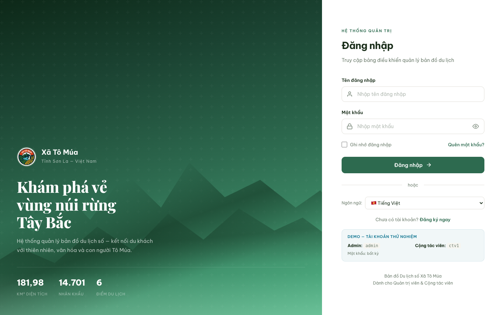

### Dashboard quản trị


### Quản lý điểm du lịch
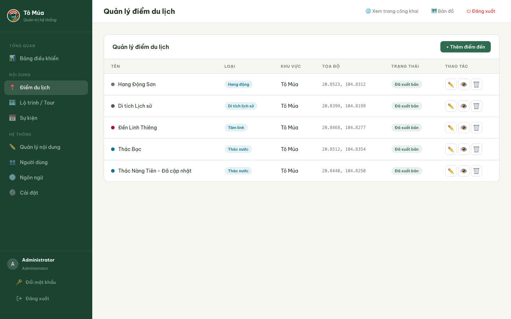

### Quản lý lộ trình
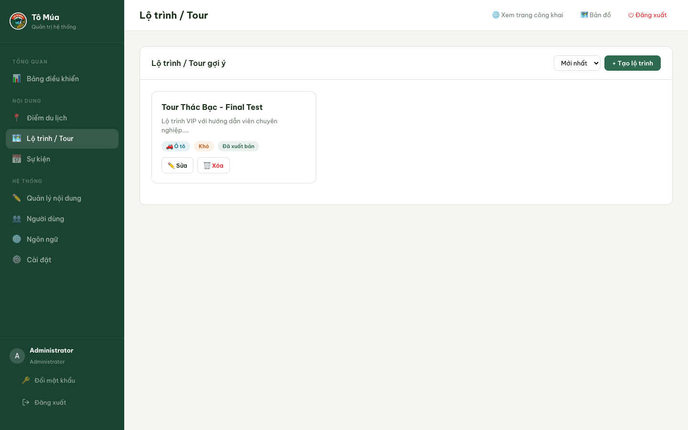

### Quản lý sự kiện
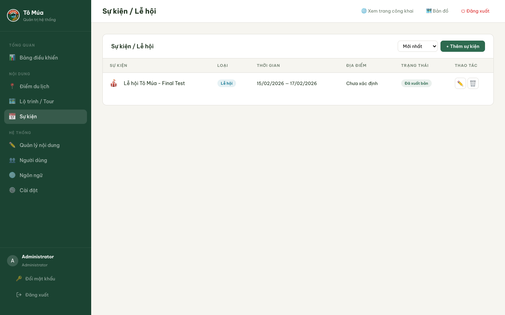

### Quản lý người dùng
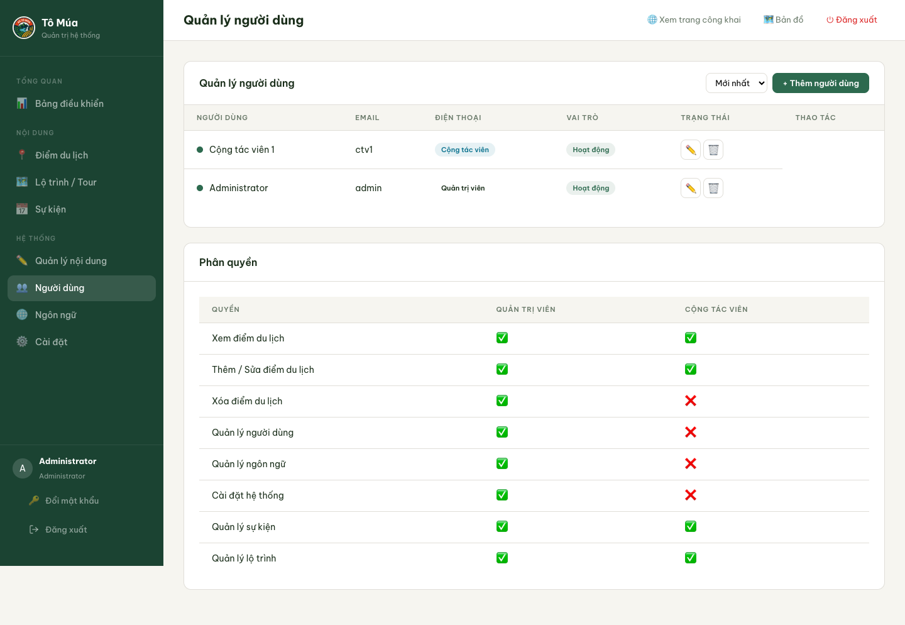

### Quản lý nội dung đa ngôn ngữ
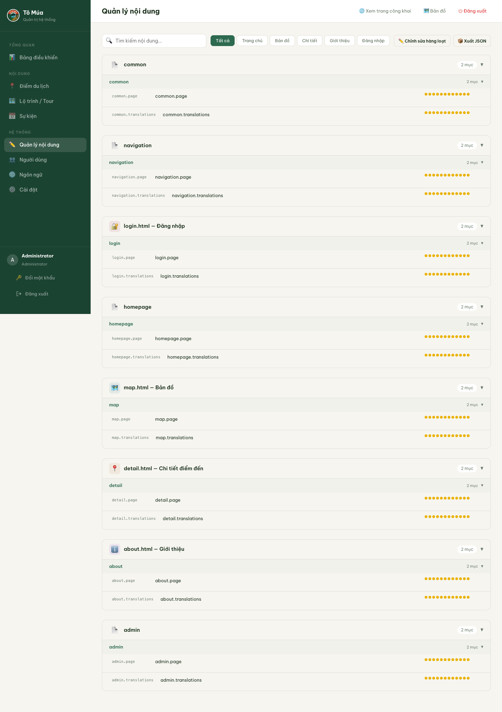

### Quản lý ngôn ngữ
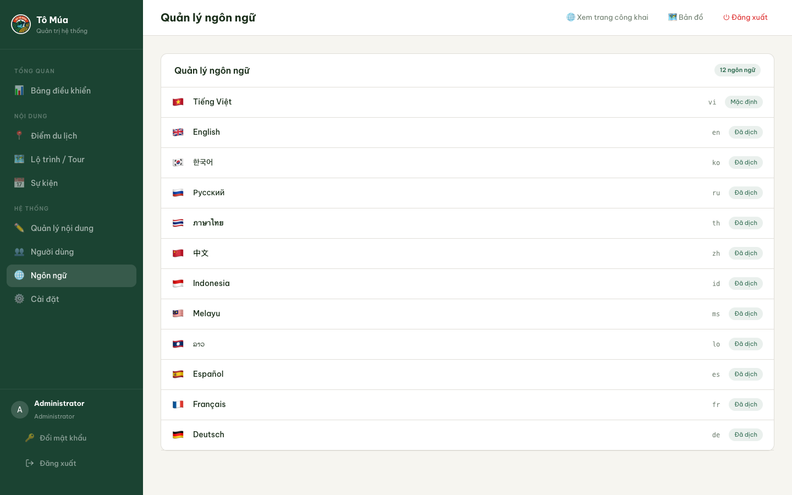

### Cài đặt hệ thống
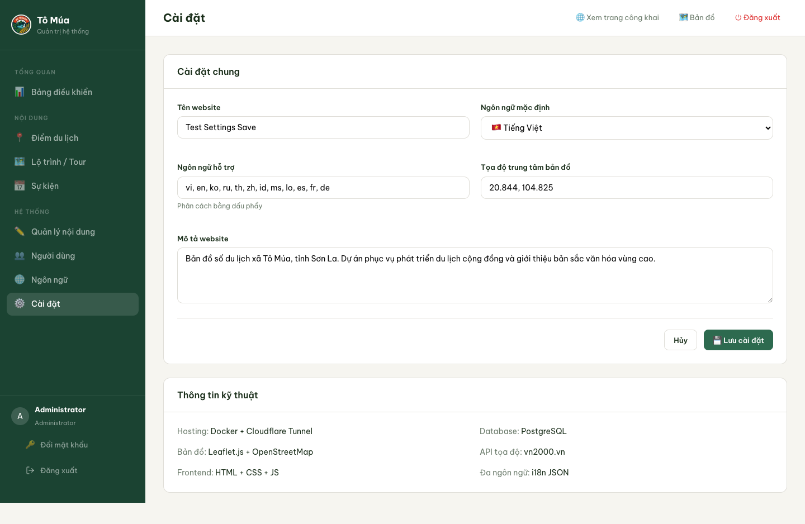

### Trang chủ
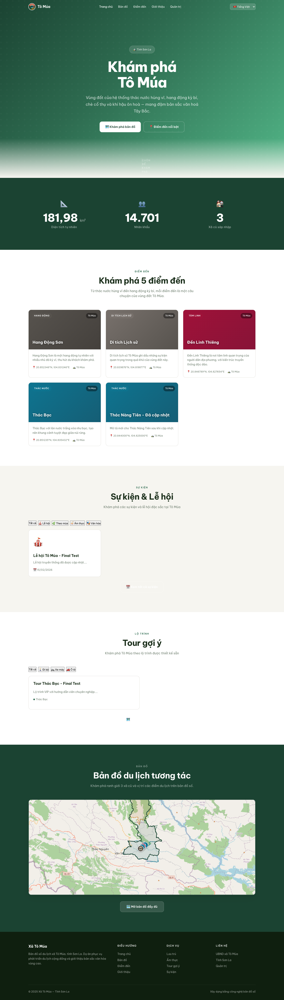

### Bản đồ tương tác
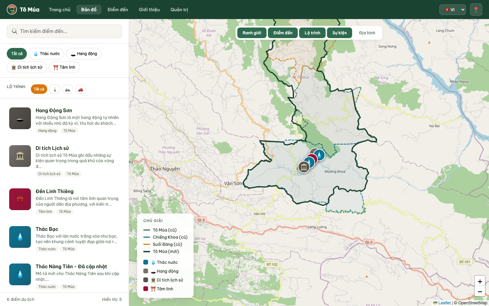

### Chi tiết điểm đến
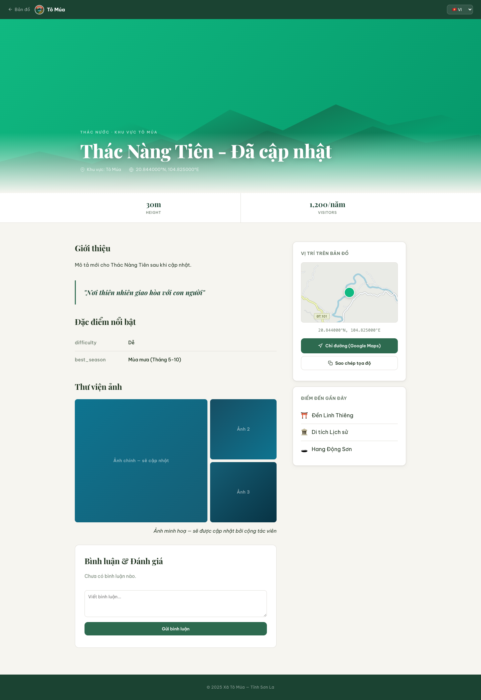

### Giới thiệu
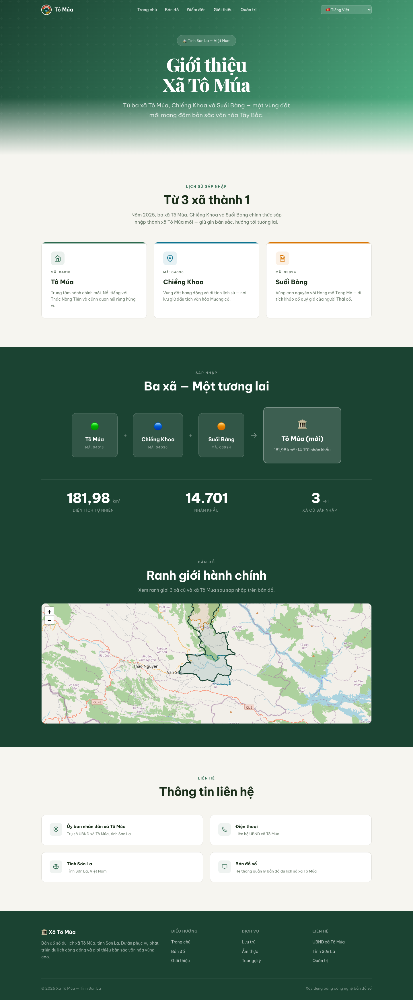

## 🛠️ Tech Stack

| Layer | Technology |
|-------|-----------|
| **Frontend** | HTML5, CSS3, JavaScript (Vanilla) |
| **Map** | Leaflet.js + OpenStreetMap |
| **Backend** | Node.js 20 + Express.js |
| **Database** | PostgreSQL 16 + PostGIS 3.4 |
| **ORM** | Knex.js |
| **Auth** | JWT (Access + Refresh tokens) |
| **Image** | Sharp (resize, convert to WebP) |
| **i18n** | i18next (12 languages) |
| **Deployment** | Docker Compose + Nginx |

## 📦 Cài đặt

### Yêu cầu
- Docker & Docker Compose
- Git

### Bước 1: Clone repository
```bash
git clone https://github.com/godBuddha/tomua-map-travel.git
cd tomua-map-travel
```

### Bước 2: Tạo file .env
```bash
cp server/.env.example .env
# Chỉnh sửa các giá trị trong .env
```

### Bước 3: Khởi động với Docker
```bash
docker compose up -d
```

### Bước 4: Chạy migrations và seed data
```bash
docker exec tomua_server npx knex migrate:latest
docker exec tomua_server npx knex seed:run
```

### Bước 5: Truy cập
- **Trang chủ:** http://localhost:3000
- **Admin:** http://localhost:3000/admin.html
- **API:** http://localhost:3000/api

## 🔑 Tài khoản mặc định

| Role | Username | Password |
|------|----------|----------|
| Admin | `admin` | `admin123456` |
| Collaborator | `ctv1` | `ctv123456` |

## 📁 Cấu trúc thư mục

```
tomua-map-travel/
├── client/                    # Frontend
│   ├── index.html            # Trang chủ
│   ├── map.html              # Bản đồ tương tác
│   ├── detail.html           # Chi tiết điểm đến
│   ├── about.html            # Giới thiệu
│   ├── login.html            # Đăng nhập
│   ├── admin.html            # Quản trị viên
│   ├── collaborator.html     # Cộng tác viên
│   ├── js/                   # JavaScript
│   │   ├── api.js            # API client
│   │   ├── config.js         # Configuration
│   │   ├── i18n-new.js       # i18n module
│   │   └── image-uploader.js # Image upload component
│   ├── lib/                  # Libraries (Leaflet)
│   └── *.geojson             # Boundary data
├── server/                    # Backend
│   ├── src/
│   │   ├── controllers/      # API controllers
│   │   ├── models/           # Database models
│   │   ├── routes/           # API routes
│   │   ├── middleware/       # Auth, validation
│   │   ├── services/         # Business logic
│   │   └── config/           # Configuration
│   ├── migrations/           # Database migrations
│   └── seeds/                # Seed data
├── screenshots/               # UI screenshots
├── docker-compose.yml         # Docker config
├── nginx.conf                 # Nginx config
└── README.md                  # This file
```

## 🔌 API Endpoints

### Auth
- `POST /api/auth/login` - Đăng nhập
- `POST /api/auth/register` - Đăng ký
- `POST /api/auth/refresh` - Refresh token
- `GET /api/auth/me` - Thông tin user hiện tại
- `POST /api/auth/logout` - Đăng xuất
- `PUT /api/auth/change-password` - Đổi mật khẩu

### Destinations
- `GET /api/destinations` - Danh sách điểm đến
- `GET /api/destinations/:id` - Chi tiết điểm đến
- `GET /api/destinations/nearby` - Điểm đến lân cận
- `POST /api/destinations` - Tạo điểm đến
- `PUT /api/destinations/:id` - Cập nhật
- `DELETE /api/destinations/:id` - Xóa
- `POST /api/destinations/:id/approve` - Phê duyệt
- `POST /api/destinations/:id/reject` - Từ chối

### Routes
- `GET /api/routes` - Danh sách lộ trình
- `GET /api/routes/:id` - Chi tiết lộ trình
- `POST /api/routes` - Tạo lộ trình
- `PUT /api/routes/:id` - Cập nhật
- `DELETE /api/routes/:id` - Xóa

### Events
- `GET /api/events` - Danh sách sự kiện
- `GET /api/events/upcoming` - Sự kiện sắp tới
- `POST /api/events` - Tạo sự kiện
- `PUT /api/events/:id` - Cập nhật
- `DELETE /api/events/:id` - Xóa

### i18n
- `GET /api/i18n/:page/:lang` - Bản dịch theo trang
- `PUT /api/i18n/:page/:key` - Cập nhật bản dịch
- `POST /api/i18n/bulk` - Cập nhật hàng loạt
- `GET /api/i18n/export/all` - Xuất tất cả bản dịch

## 🌐 Ngôn ngữ hỗ trợ

| Code | Language | Flag |
|------|----------|------|
| vi | Tiếng Việt | 🇻🇳 |
| en | English | 🇬🇧 |
| ko | 한국어 | 🇰🇷 |
| ru | Русский | 🇷🇺 |
| th | ภาษาไทย | 🇹🇭 |
| zh | 中文 | 🇨🇳 |
| id | Indonesia | 🇮🇩 |
| ms | Melayu | 🇲🇾 |
| lo | ລາວ | 🇱🇦 |
| es | Español | 🇪🇸 |
| fr | Français | 🇫🇷 |
| de | Deutsch | 🇩🇪 |

## 🔒 Bảo mật

- ✅ JWT authentication (Access + Refresh tokens)
- ✅ Role-based access control (Admin/Collaborator)
- ✅ Rate limiting (API + Auth endpoints)
- ✅ Helmet security headers
- ✅ CORS configuration
- ✅ Input validation (express-validator)
- ✅ SQL injection prevention (parameterized queries)
- ✅ Path traversal protection
- ✅ Mass assignment protection

## 📊 Database Schema

### Tables
- `users` - Người dùng (admin/collaborator)
- `destinations` - Điểm du lịch (PostGIS Point)
- `routes` - Lộ trình (PostGIS LineString)
- `route_stops` - Điểm dừng trong lộ trình
- `events` - Sự kiện/lễ hội
- `destination_images` - Hình ảnh điểm đến
- `approval_comments` - Bình luận phê duyệt
- `i18n_content` - Nội dung đa ngôn ngữ
- `refresh_tokens` - JWT refresh tokens
- `system_settings` - Cài đặt hệ thống

## 🤝 Đóng góp

1. Fork repository
2. Tạo feature branch (`git checkout -b feature/AmazingFeature`)
3. Commit changes (`git commit -m 'Add AmazingFeature'`)
4. Push to branch (`git push origin feature/AmazingFeature`)
5. Tạo Pull Request

## 📄 License

Dự án này được phát triển phục vụ UBND xã Tô Múa, tỉnh Sơn La.

## 📞 Liên hệ

- **Website:** [Bản đồ Du lịch Tô Múa](http://localhost:3000)
- **Repository:** [GitHub](https://github.com/godBuddha/tomua-map-travel)

---

<p align="center">Được phát triển với ❤️ cho du lịch cộng đồng Xã Tô Múa</p>
